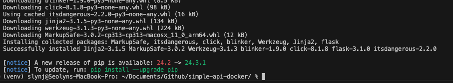

# Containerizing a Flask API with Docker

## 1. Prerequisite

Ensure that Python and Docker desktop is installed. Refer to the [docker official website](https://www.docker.com/) for installation guide.

## 2. Set Virtual Environment

Create a Python virtual environment using the command below. It’s recommended to use venv because it allows you to install only the dependencies needed for this project.

```python
python3 -m venv venv
source venv/bin/activate
```

## 3. Create a Simple API

### Install Flask

```bash
pip install flask
```



### Create `app.py`

I created a directory named `app`, then added `app.py` in the directory.

```python
from flask import Flask, jsonify

app = Flask(__name__)

@app.route('/api', methods=['GET'])
def get_data():
    return jsonify({'message': 'Hello, Docker!'})

if __name__ == '__main__':
    app.run(host='0.0.0.0', port=5000)
```

This simple API returns “Hello, Docker!” as a response at the `/api` endpoint.

### Create `requirements.txt`

Create a new txt file called `requirements.txt` to put in all the dependencies.

```python
pip freeze > requirements.txt
```

You should be able to see the dependencies of this project and their versions.


## 4. Create Dockerfile

> A **Dockerfile** is a text file containing a set of instructions that Docker uses to build a **Docker image**. It defines the steps needed to create an image that can run the application in a containerized, isolated environment.
> 

Create a `Dockerfile` in the root of the directory. 

```docker
FROM python:3.9-slim
WORKDIR /app
COPY . /app
RUN pip install --no-cache-dir -r requirements.txt 
CMD ["python", "app.py"]
```

| command | desc |
| --- | --- |
| `FROM` | Specifies the base image to build the container from. In this case, `python:3.9-slim` is a lightweight version of Python 3.9. |
| `WORK` | Sets the working directory inside the container to `/app`. Any subsequent commands like `COPY` or `RUN` will execute relative to this directory.  |
| `COPY` | Copies files and directories from the current directory (on your machine) to the specified directory inside the container (`/app` in this case). This ensures your code and dependencies are included in the container. |
| `RUN` | Executes a command during the build phase of the container. Here, `pip install --no-cache-dir -r requirements.txt` installs Python dependencies listed in `requirements.txt`. The `--no-cache-dir` option prevents caching, reducing the image size. |
| `CMD` | Specifies the default command to run when the container starts. `["python", "app.py"]` means the container will execute python `app.py`, starting the Flask application. |

## 5. Create `.dockerignore`

> A `.dockerignore` file tells Docker which files or directories to exclude when building the image. This keeps the image clean and lightweight by avoiding unnecessary files.
> 

Create a `.dockerignore` file at the root as well.

```docker
venv/
__pycache__/
*.pyc
*.pyo
```

| entry | desc |
| --- | --- |
| `venv/` | Excludes the Python virtual environment folder. The virtual environment is not needed in the container because the container itself provides a separate environment. |
| `__pycache__/` | Excludes Python’s compiled bytecode cache files. →  not necessary in the container and only take up space. |
| `*.pyc` | Excludes Python compiled files (`.pyc`). These are automatically generated by Python → do not need to be included in the image. |
| `*.pyo` | Excludes optimized Python compiled files (`.pyo`). → also unnecessary in the image. |

## 6.  Docker Image Build

> A Docker image is an  executable package that includes everything needed to run an application. (Code, Runtime, Libraries, Configurations, etc.) !immutable!
> 
> 
> Docker image → blueprint for creating containers. A container is a running **instance of an image.**
> 

> Image build process → creating a Docker image based on instructions defined in a `Dockerfile` that we just created.
>

Go to your project (root) directory. For me, it is `simple api-docker`.

```bash
cd ~/Documents/Github/simple-api-docker
```

Then build the docker image. Note that the `-t` option sets the title of the image, and the `.` means current directory.

```bash
docker build -t simple-api-docker .
```


You can optionally verify the image created by the command below.

```bash
docker images
```


## 7. Run Container

> Container is a running instance of a Docker image, providing an isolated environment for the application. Runtime environment created from the Docker Image.
> 

> Run container is the process of starting a container from a Docker image, making the application active and operational.
>

```bash
docker run -d -p 5000:5000 flask-docker-api
```


| command / flag | desc |
| --- | --- |
| `docker run` | Primary command to create and start a container from a Docker image. Downloads the specified image (if it doesn’t already exist locally) → creates a container based on the image → starts the container. |
| `-d` | Detached mode. Runs the container in the background. |
| `-p` | Port mapping. `<host-port>:<container-port>` . Maps a port on the host machine to a port inside the container. 8000 → The port on the host machine (your computer) where the application will be accessible. 5000 →The port inside the container where the application is running. |

Verify that the container is running with the command below.

```bash
docker ps
```

Note that you can add the flag `-a` to see exited containers as well.

Some other useful commands for troubleshooting:

```bash
docker logs <containerID>
docker rm <containerID>
```

You should also be able to see the docker container on the docker desktop.


## 8. Test API

You can use curl command to call the API (from where it’s reachable). You should be able to see the response.

```bash
curl http://localhost:8000/api
```


